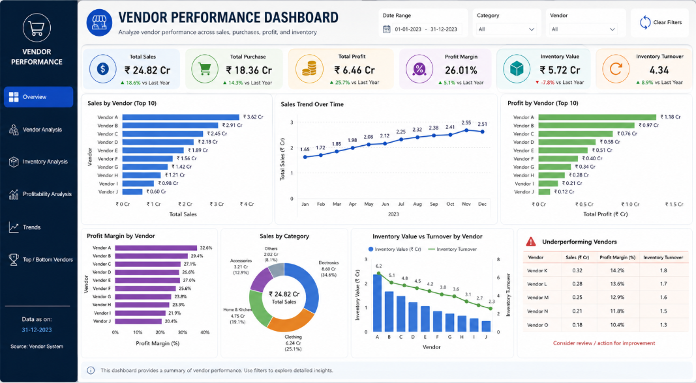

# 📊 Vendor Performance Analysis

## 📌 Project Overview

The **Vendor Performance Analysis** project aims to evaluate vendor efficiency, profitability, inventory management, and sales performance using data analytics techniques. The analysis helps identify top-performing vendors, optimize purchasing decisions, and uncover opportunities to improve overall business performance.

This project involves data extraction, cleaning, exploratory data analysis (EDA), statistical analysis, and visualization to generate actionable business insights.

---

## 🎯 Objectives

- Analyze vendor-wise sales and purchase performance.
- Identify top and underperforming vendors.
- Evaluate inventory turnover and unsold inventory.
- Measure vendor profitability and contribution to revenue.
- Discover trends and patterns that can support strategic business decisions.

---

## 🛠️ Tech Stack

- **Python**
- **Pandas**
- **NumPy**
- **Matplotlib**
- **Seaborn**
- **SciPy**
- **MySQL**
- **SQLAlchemy**
- **Jupyter Notebook**

---

## 📂 Project Structure

```text
Vendor-Performance-Analysis/
│
├── data/                        # Raw and processed datasets
├── notebooks/
│   ├── Exploratory Data Analysis.ipynb
│   └── Vendor Performance Analysis.ipynb
│
├── scripts/                     # Python scripts (if any)
├── dashboard/                   # Power BI dashboard files (optional)
├── images/                      # Visualizations and screenshots
├── README.md
└── requirements.txt
---

## Dashboard Preview


---

## Author
**Monika Jaiswal**
- LinkedIn: www.linkedin.com/in/monika-jaisvval
- Naukri: [https://www.naukri.com/mnjuser/profile?id=&altresid]
- Email: monikajaisvval@gmail.com